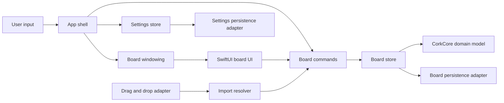
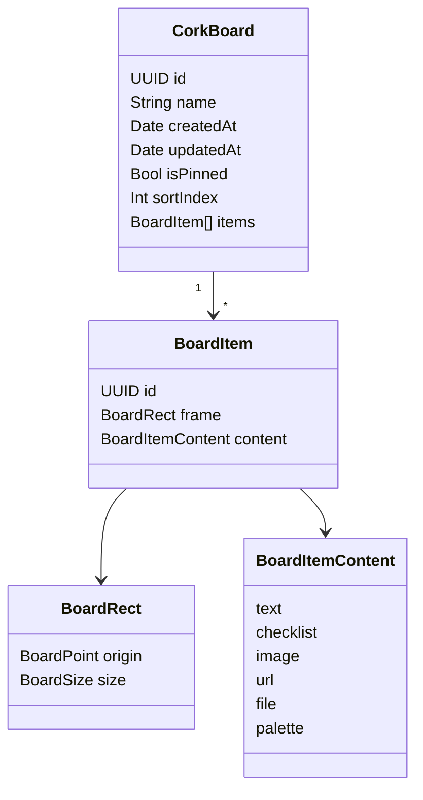
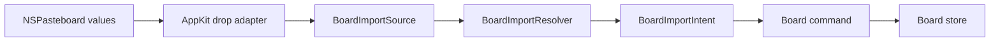

# Cork Architecture

Cork should feel like a native macOS utility that happens to contain a board, not a document app with a hidden window. The architecture is designed around fast presentation, small focused features, and a domain model that can grow without coupling every decision to SwiftUI or AppKit.

## Goals

- Keep launch and toggle behavior instant.
- Keep windowing concerns isolated from board content.
- Keep board data testable without UI frameworks.
- Prefer native macOS APIs over third-party dependencies.
- Add features through small adapters and card views instead of broad rewrites.
- Make persistence boring, local, and migration-friendly.

## Non-Goals

- Cork is not a long-form writing environment.
- Cork is not a file manager.
- Cork is not a collaborative whiteboard.
- Cork is not a replacement for full note-taking systems.

Those apps can keep being excellent at deep work. Cork should stay excellent at ambient context.

## Runtime Shape



The important boundary is that `CorkCore` does not know about AppKit, SwiftUI, global hot keys, or storage frameworks. It models boards, cards, positions, and user-level operations.

## Layers

### App Shell

The shell owns lifecycle and high-level commands.

Current files:

- `Sources/Cork/App/CorkApp.swift`
- `Sources/Cork/App/AppCoordinator.swift`
- `Sources/Cork/App/CorkDialogs.swift`
- `Sources/Cork/App/LaunchAtLoginController.swift`
- `Sources/Cork/App/MenuBarContent.swift`
- `Sources/Cork/App/PreferencesWindowController.swift`
- `Sources/Cork/App/QuickStartWindowController.swift`

Responsibilities:

- Set Cork's accessory app behavior.
- Create the menu bar surface.
- Register global shortcuts.
- Route user commands to the board store and panel controller.
- Present native prompts for lightweight card and board editing.
- Present the Preferences window.
- Present the Quick Start guide once for new users and on demand from either Settings surface.
- Bridge system settings such as launch at login, including approval-required states and a direct route to Login Items settings.
- Keep app-level state such as whether the board is visible.

The shell should remain thin. It should not directly encode board data, perform imports, or know persistence details.

### Release Packaging

Current files:

- `Cork.xcodeproj`
- `Packaging/Info.plist`
- `Packaging/Cork.entitlements`
- `Packaging/PrivacyInfo.xcprivacy`
- `Packaging/AppIcon/Cork-AppIcon-Master-1024.png`
- `Packaging/Assets.xcassets/AppIcon.appiconset`

The Swift package remains the fast development and test harness. The `Cork App` Xcode scheme builds the distributable macOS app, compiles `Sources/Cork`, links the local `CorkCore` package product, and owns bundle identity, signing, entitlements, asset compilation, privacy metadata, and App Store configuration.

The release target enables App Sandbox and Hardened Runtime. Its file access is limited to Cork's container and read-only files explicitly selected or dragged by the user. Cork creates app-scoped, read-only security bookmarks at selection or drop time, stores them with image and file cards, and resolves them only while generating thumbnails or performing file actions.

The app-icon master is square and unmasked so macOS can apply its system corner treatment. The asset catalog supplies every required macOS size and is validated with Xcode's asset compiler before being attached to the release target.

### Hot Keys

Current files:

- `Sources/Cork/HotKeys/GlobalHotKey.swift`
- `Sources/Cork/HotKeys/HotKeyController.swift`
- `Sources/Cork/HotKeys/HotKeyPresentation.swift`
- `Sources/Cork/HotKeys/HotKeyRecorderView.swift`

The implementation uses Carbon event hot keys because they are still the practical native route for app-level global keyboard shortcuts on macOS. `HotKeyController` observes `SettingsStore`, unregisters the previous shortcut, and registers the currently saved `HotKeyConfiguration`. Presentation helpers keep display names, menu-key equivalents, and recorder input mapping out of the app coordinator.

Near-term considerations:

- Keep registration failures visible in Preferences without interrupting normal menu-bar use.
- Preserve the menu bar command as a fallback whenever a shortcut is unavailable.
- Add more key-name coverage only when manual testing shows a real shortcut display gap.

### Windowing

Current file:

- `Sources/Cork/Board/BoardPanelController.swift`

The board is an `NSPanel` hosted by AppKit, with SwiftUI content inside an `NSHostingController`.

Responsibilities:

- Choose the target screen.
- Calculate hidden and visible frames.
- Animate from the configured slide edge.
- Keep the panel lightweight and non-document-like.
- Use normal window stacking while visible so users can bring other app windows in front by clicking them.
- Support board surface opacity and card opacity through separate SwiftUI view layers.
- Render each card's persisted background and font choices through a shared card appearance layer.
- Support compact, standard, and large display modes for different drag-and-drop workflows.
- Support optional custom title-bar and board-surface colors without replacing the selected theme texture.
- Eventually support deeper multi-monitor behavior and active-application rules.

The panel controller should not know how board items are stored or rendered. It only hosts the board surface.

### Board UI

Current files:

- `Sources/Cork/Board/BoardKeyboardView.swift`
- `Sources/Cork/Board/BoardMouseInputView.swift`
- `Sources/Cork/Board/BoardView.swift`
- `Sources/Cork/Board/BoardCardView.swift`
- `Sources/Cork/Board/BoardConnectionsView.swift`
- `Sources/Cork/Board/FileImageThumbnailView.swift`

The board UI is SwiftUI. It should prioritize direct manipulation and glanceability.

Guidelines:

- Keep the canvas flat and immediately usable.
- Avoid navigation stacks, inspectors, and persistent sidebars in the default board.
- Prefer contextual controls that appear when selecting or hovering over a card.
- Render card-name hover labels above cards but beneath the transparent pointer-capture layer so names remain visible without changing hit testing.
- Keep card dimensions stable while dragging or editing.
- Make keyboard actions first-class.
- Keep card and board editing lightweight, using native dialogs instead of persistent inspectors.
- Keep board switching available on the board title bar.
- Keep command menus mirrored between the menu bar and board title bar when the command naturally belongs in both places.
- Prefer compact labeled title-bar controls over icon-only controls when the command meaning is not immediately obvious.
- Keep Preferences reachable from both the menu bar and board title bar.
- Render board themes as surface backgrounds, not separate board types.
- Render persisted card connections beneath cards so movement and resizing update their endpoints automatically.
- Keep connection drawing as transient board UI state: the title-bar tool owns its selected mode and live preview, while completed connections flow through `BoardStore` for validation and persistence.
- Route connection pointer gestures through `BoardMouseInputView` so string drawing temporarily replaces card movement with a crosshair source-to-target drag.
- Route create, edit, duplicate, delete, move, and board lifecycle actions through `BoardStore`.
- Route resizing through `BoardStore` so pointer, keyboard, and future command surfaces share one layout policy.
- Render file-backed images from cached downsampled thumbnails instead of decoding original files from SwiftUI body evaluation.

### Domain Model

Current files:

- `Sources/CorkCore/AppSettings.swift`
- `Sources/CorkCore/BoardImportIntent.swift`
- `Sources/CorkCore/BoardImportResolver.swift`
- `Sources/CorkCore/BoardModels.swift`
- `Sources/CorkCore/BoardStore.swift`
- `Sources/CorkCore/BoardTemplates.swift`
- `Sources/CorkCore/SettingsStore.swift`

`CorkCore` owns board state and user-level operations.

Current model:

- `CorkBoard`
- `BoardItem`
- `BoardItemContent`
- `BoardConnection`
- `BoardConnectionStyle`
- `CardAppearance`
- `CardFontDesign`
- `BoardTemplate`
- `BoardImportIntent`
- `BoardImportResolver`
- `TextCard`
- `ChecklistCard`
- `ImageCard`
- `URLCard`
- `BoardRect`
- `BoardPoint`
- `BoardSize`
- `AppSettings`
- `BoardTheme`
- `BoardDisplayMode`
- `HotKeyConfiguration`
- `HotKeyModifier`

The domain model should stay platform-light. It can use `Foundation` value types like `UUID`, `Date`, and `URL`, but should avoid `NSView`, `NSImage`, `SwiftUI.Image`, and persistence framework annotations unless there is a strong reason.

### Persistence

Persistence is implemented behind a small repository protocol so Cork can keep a simple runtime model.

Current shape:

```swift
public protocol BoardRepository {
    func loadSnapshot() throws -> BoardLibrarySnapshot?
    func saveSnapshot(_ snapshot: BoardLibrarySnapshot) throws
}

public protocol SettingsRepository {
    func loadSettings() throws -> AppSettings?
    func saveSettings(_ settings: AppSettings) throws
}
```

The first board implementation is `JSONBoardRepository`, which stores a `BoardLibrarySnapshot` at:

```text
~/Library/Application Support/Cork/boards.json
```

The first settings implementation is `JSONSettingsRepository`, which stores `AppSettings` at:

```text
~/Library/Application Support/Cork/settings.json
```

Current persistence behavior:

- Save all boards.
- Save the selected board ID.
- Save card frames and card content.
- Save each card's optional background color and font design.
- Save card-to-card connections and their line or string style.
- Save boards created from templates as ordinary editable boards with no ongoing template dependency.
- Save board names, pinned state, board ordering, and board lifecycle changes.
- Save created and edited text, Markdown, checklist, image, URL, file, and palette cards.
- Save replacement image references without changing the surrounding card state.
- Save resized card frames.
- Save local image cards as file references.
- Save read-only security-scoped bookmarks with local image and file references.
- Save dropped image cards as local file references.
- Save dropped text cards as text cards.
- Save dropped web URLs as URL cards.
- Save dropped non-image files as file cards.
- Restore state automatically on launch.
- Fall back to sample boards if no saved state exists.
- Debounce autosaves while cards are dragged.
- Remove connections automatically when one of their cards is deleted.
- Remap connection endpoints when a board is duplicated.
- Flush pending autosaves when Cork quits.

Current settings behavior:

- Save board surface opacity.
- Save card opacity.
- Save the selected board theme.
- Save custom board color enablement and color values.
- Save the selected board display mode.
- Save the selected slide edge.
- Save the user's launch-at-login preference.
- Save the user's global keyboard shortcut.
- Save whether the current Quick Start guide has been presented.
- Restore settings automatically on launch.
- Fall back to strong defaults if no saved settings exist.
- Debounce settings autosaves.
- Flush pending settings autosaves when Cork quits.

Storage notes:

- JSON is the right first storage layer because the domain model is already `Codable`, easy to test, and easy to inspect during early development.
- SwiftData can still replace the repository internals later if Cork needs richer querying or migrations.
- Imported image/file assets should be stored in Application Support.
- Older snapshots remain compatible because bookmark fields are optional. A pre-bookmark card may need its image replaced or file dropped again to grant durable sandbox access.

The important design point is that persistence remains isolated. Cork should be able to evolve storage without changing board rendering or windowing code.

## Data Model



The current app implements text, checklist, image, URL, file, and palette cards. Text cards can render either plain text or Markdown through `TextCardFormat`, so Markdown notes share the same domain payload and editing path as ordinary notes. Image cards can use bundled SF Symbols for samples or local file references for user-created images. URL cards store a title and web URL, render lightweight native link cards, and open links through `NSWorkspace` in the app layer. File cards store a title and referenced local URL, render native document-style cards, and use `NSWorkspace` for open and reveal actions. Palette cards store normalized hex colors and render compact swatches for glanceable design context.

## Commands

Views should use explicit board commands rather than mutating arbitrary state. This keeps menus, hot keys, drag-and-drop, Apple Shortcuts, and future automation hooks pointed at the same behavior.

Examples:

- `selectBoard(id:)`
- `createBoard(name:)`
- `renameBoard(id:name:)`
- `setBoardPinned(id:isPinned:)`
- `toggleBoardPinned(id:)`
- `moveBoard(id:toIndex:)`
- `duplicateBoard(id:)`
- `deleteBoard(id:)`
- `createTextCard(title:body:format:at:)`
- `createChecklistCard(title:entries:at:)`
- `createImageCard(title:source:at:)`
- `createURLCard(title:url:at:)`
- `createFileCard(title:url:at:)`
- `createColorPaletteCard(title:colors:at:)`
- `updateTextCard(_:title:body:format:)`
- `updateChecklistCard(_:title:entries:)`
- `updateImageCard(_:title:source:)`
- `updateURLCard(_:title:url:)`
- `updateColorPaletteCard(_:title:colors:)`
- `updateItemPosition(_:to:)`
- `resizeItem(_:to:)`
- `resizeSelectedItem(to:)`
- `moveSelectedItem(by:)`
- `duplicateItem(_:)`
- `deleteItem(_:)`
- `importItems(_:at:constrainedTo:)`

The command layer currently lives in `BoardStore`. If it grows too large, the next extraction should be a small command facade around the store rather than direct view mutation.

Board management is intentionally still lightweight:

- Pinned boards are regular boards with `isPinned` metadata, not a separate collection.
- Board ordering is stored with `sortIndex` and normalized after create, move, duplicate, and delete operations.
- Duplicating a board copies its cards with new item IDs, selects the copy, and leaves the copy unpinned.
- The menu bar `Boards` menu lists boards first, with pinned boards above unpinned boards, then shows current-board actions.

## Drag and Drop

Drag-and-drop is implemented as an import pipeline:



Current drop types:

- Image files from Finder.
- File URLs from Finder.
- Web URLs from browsers.
- Plain text snippets.

Current behavior:

- Image file drops create image cards backed by file references.
- Image file cards render downsampled cached thumbnails for interactive performance.
- Plain text drops create text cards.
- Web URL drops create URL cards.
- Non-image file drops create dedicated file cards.
- Drops land at the board-coordinate drop location and stagger when multiple files are imported.

Copy-versus-reference behavior should remain explicit:

- Local files currently start as references.
- The thumbnail cache is an in-memory render cache, not durable copied asset storage.
- File cards currently reference the original local file path.
- Copied-file support belongs in an asset storage adapter under Application Support.
- Images dropped from the web should eventually be copied into Cork's app support storage.
- URL cards are intentionally lightweight for now; rich previews and favicons should be optional and cached.

## Error Handling

Cork should avoid interruptive alerts for normal utility behavior.

Use:

- Quiet fallbacks for missing saved state.
- Small non-blocking indicators for failed imports.
- Preferences diagnostics for hot-key registration problems.
- Logged errors for unexpected persistence failures during development.

As the app matures, user-visible recovery should be added for cases where data might not save.

## Testing Strategy

Keep tests concentrated around behavior that should not regress:

- Board selection.
- Board pinning, ordering, duplication, and lifecycle commands.
- Card movement and resizing bounds.
- Card creation commands.
- Card editing commands.
- URL import and URL card command behavior.
- Board creation, rename, and deletion commands.
- Persistence round trips.
- Import intent resolution.
- App settings defaults, decoding, persistence, and update commands.
- Board theme and display-mode settings.
- Keyboard shortcut validation and autosave behavior.
- Large-image interaction behavior through manual QA.

UI animation and AppKit panel behavior can remain manually verified early, then gain focused tests once packaging and UI structure settle.

## Extension Points

- New card types add a domain payload, a card renderer, and command support.
- New import sources add resolver code that produces card creation intents.
- Search indexes domain content and file metadata, not rendered views.
- Apple Shortcuts calls the same command layer used by menu items and hot keys.
- Multiple monitor support belongs in windowing, not board state.
