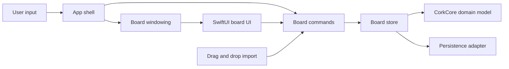
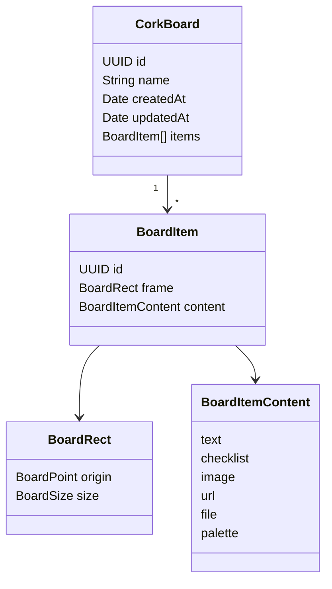
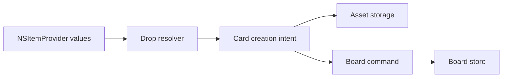

# Cork Architecture

Cork should feel like a native macOS utility that happens to contain a board, not a document app with a hidden window. The architecture is designed around fast presentation, small focused features, and a domain model that can grow without coupling every decision to SwiftUI or AppKit.

## Goals

- Keep launch and toggle behavior instant.
- Keep windowing concerns isolated from board content.
- Keep board data testable without UI frameworks.
- Prefer native macOS APIs over third-party dependencies.
- Add features through small adapters and card views instead of broad rewrites.
- Make persistence boring, local, and migration-friendly.

## Non-Goals

- Cork is not a long-form writing environment.
- Cork is not a file manager.
- Cork is not a collaborative whiteboard.
- Cork is not a replacement for full note-taking systems.

Those apps can keep being excellent at deep work. Cork should stay excellent at ambient context.

## Runtime Shape



The important boundary is that `CorkCore` does not know about AppKit, SwiftUI, global hot keys, or storage frameworks. It models boards, cards, positions, and user-level operations.

## Layers

### App Shell

The shell owns lifecycle and high-level commands.

Current files:

- `Sources/Cork/App/CorkApp.swift`
- `Sources/Cork/App/AppCoordinator.swift`
- `Sources/Cork/App/CorkDialogs.swift`
- `Sources/Cork/App/MenuBarContent.swift`

Responsibilities:

- Set Cork's accessory app behavior.
- Create the menu bar surface.
- Register global shortcuts.
- Route user commands to the board store and panel controller.
- Present native prompts for lightweight card and board editing.
- Keep app-level state such as whether the board is visible.

The shell should remain thin. It should not directly encode board data, perform imports, or know persistence details.

### Hot Keys

Current file:

- `Sources/Cork/HotKeys/GlobalHotKey.swift`

The first implementation uses Carbon event hot keys because they are still the practical native route for app-level global keyboard shortcuts on macOS.

Near-term considerations:

- Detect registration failure and expose it in a small diagnostics path.
- Move key binding configuration behind a `HotKeyConfiguration` value.
- Later, add a settings UI for changing the shortcut.

### Windowing

Current file:

- `Sources/Cork/Board/BoardPanelController.swift`

The board is an `NSPanel` hosted by AppKit, with SwiftUI content inside an `NSHostingController`.

Responsibilities:

- Choose the target screen.
- Calculate hidden and visible frames.
- Animate from the top edge.
- Keep the panel lightweight and non-document-like.
- Eventually support edges, opacity, multi-monitor behavior, and active-application rules.

The panel controller should not know how board items are stored or rendered. It only hosts the board surface.

### Board UI

Current files:

- `Sources/Cork/Board/BoardKeyboardView.swift`
- `Sources/Cork/Board/BoardMouseInputView.swift`
- `Sources/Cork/Board/BoardView.swift`
- `Sources/Cork/Board/BoardCardView.swift`

The board UI is SwiftUI. It should prioritize direct manipulation and glanceability.

Guidelines:

- Keep the canvas flat and immediately usable.
- Avoid navigation stacks, inspectors, and persistent sidebars in the default board.
- Prefer contextual controls that appear when selecting or hovering over a card.
- Keep card dimensions stable while dragging or editing.
- Make keyboard actions first-class.
- Keep card and board editing lightweight, using native dialogs instead of persistent inspectors.
- Route create, edit, duplicate, delete, move, and board lifecycle actions through `BoardStore`.

### Domain Model

Current files:

- `Sources/CorkCore/BoardModels.swift`
- `Sources/CorkCore/BoardStore.swift`

`CorkCore` owns board state and user-level operations.

Current model:

- `CorkBoard`
- `BoardItem`
- `BoardItemContent`
- `TextCard`
- `ChecklistCard`
- `ImageCard`
- `BoardRect`
- `BoardPoint`
- `BoardSize`

The domain model should stay platform-light. It can use `Foundation` value types like `UUID`, `Date`, and `URL`, but should avoid `NSView`, `NSImage`, `SwiftUI.Image`, and persistence framework annotations unless there is a strong reason.

### Persistence

Persistence is implemented behind a small repository protocol so Cork can keep a simple runtime model.

Current shape:

```swift
public protocol BoardRepository {
    func loadSnapshot() throws -> BoardLibrarySnapshot?
    func saveSnapshot(_ snapshot: BoardLibrarySnapshot) throws
}
```

The first implementation is `JSONBoardRepository`, which stores a `BoardLibrarySnapshot` at:

```text
~/Library/Application Support/Cork/boards.json
```

Current persistence behavior:

- Save all boards.
- Save the selected board ID.
- Save card frames and card content.
- Save board names and board lifecycle changes.
- Save created and edited text, checklist, and image cards.
- Save local image cards as file references.
- Restore state automatically on launch.
- Fall back to sample boards if no saved state exists.
- Debounce autosaves while cards are dragged.
- Flush pending autosaves when Cork quits.

Storage notes:

- JSON is the right first storage layer because the domain model is already `Codable`, easy to test, and easy to inspect during early development.
- SwiftData can still replace the repository internals later if Cork needs richer querying or migrations.
- Imported image/file assets should be stored in Application Support.
- Security-scoped bookmarks will be needed for external file references when Cork links rather than copies.

The important design point is that persistence remains isolated. Cork should be able to evolve storage without changing board rendering or windowing code.

## Data Model



The current app implements text, checklist, and image cards. Image cards can use bundled SF Symbols for samples or local file references for user-created images. URL, file, and palette cards should be added through new `BoardItemContent` cases and narrow card views.

## Commands

Views should use explicit board commands rather than mutating arbitrary state. This keeps menus, hot keys, drag-and-drop, Apple Shortcuts, and future automation hooks pointed at the same behavior.

Examples:

- `selectBoard(id:)`
- `createBoard(name:)`
- `renameBoard(id:name:)`
- `deleteBoard(id:)`
- `createTextCard(title:body:at:)`
- `createChecklistCard(title:entries:at:)`
- `createImageCard(title:source:at:)`
- `updateTextCard(_:title:body:)`
- `updateChecklistCard(_:title:entries:)`
- `updateImageCard(_:title:source:)`
- `updateItemPosition(_:to:)`
- `moveSelectedItem(by:)`
- `duplicateItem(_:)`
- `deleteItem(_:)`
- `importDroppedItems(_:at:)`

The command layer currently lives in `BoardStore`. If it grows too large, the next extraction should be a small command facade around the store rather than direct view mutation.

## Drag and Drop

Drag-and-drop should be implemented as an import pipeline:



Expected drop types:

- Images from Finder, Safari, Photos, and browsers.
- File URLs from Finder.
- Web URLs from browsers.
- Plain text snippets.

Copy-versus-reference behavior should be explicit:

- Images dropped from the web should usually be copied into Cork's app support storage.
- Local files should start as references, with copied-file support later.
- URLs should become URL cards, eventually with rich previews.

## Error Handling

Cork should avoid interruptive alerts for normal utility behavior.

Use:

- Quiet fallbacks for missing saved state.
- Small non-blocking indicators for failed imports.
- Menu diagnostics for hot-key registration problems.
- Logged errors for unexpected persistence failures during development.

As the app matures, user-visible recovery should be added for cases where data might not save.

## Testing Strategy

Keep tests concentrated around behavior that should not regress:

- Board selection.
- Card movement and resizing bounds.
- Card creation commands.
- Card editing commands.
- Board creation, rename, and deletion commands.
- Persistence round trips.
- Import intent resolution.

UI animation and AppKit panel behavior can remain manually verified early, then gain focused tests once packaging and UI structure settle.

## Extension Points

- New card types add a domain payload, a card renderer, and command support.
- New import sources add resolver code that produces card creation intents.
- Search indexes domain content and file metadata, not rendered views.
- Apple Shortcuts calls the same command layer used by menu items and hot keys.
- Multiple monitor support belongs in windowing, not board state.
